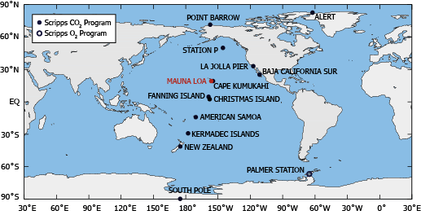

# Data sources

The data sources of this project are from [*Scipps CO2 Program*](https://scrippsco2.ucsd.edu)

## Sampling stations

Atmospheric CO2 Data collected from active sampling station. Below is the information for each sampling station. We will be using the *Station Code* column representing each station throughout the project. And the location information is used for analysis in Chapter 5.

Below is the map for the locations of several different inspection stations.


```{r, echo=FALSE, results='asis'}
library(tidyverse)
names <- read_csv("./data/station_names.csv")
knitr::kable(names, caption = "Sampling stations", row.names = F, font_size = 8)
```

**Issues with this dataset: **

All stations are located in the pacific area along having similar longitude. Lack of information from other continents and longtitudes.

## CO2 concentrations categories

**Dataset : monthly_flask_co2_(station code).csv**

The data include all the CO2 concentration collected from Flask CO2 provided by Scripps CO2 Program.

```{r, echo=FALSE, results='asis'}
columns <- read_csv("./data/colnames1.csv")
knitr::kable(columns, caption = "Major columns used", row.names = F, font_size = 8)
```

**Issues with this dataset: **

The starting time of the collection for different stations are different. Some stations start in early 1960s, while other stations have large number of missing values from 1960s through 1980s. This may create inconsistency if we generate analysis on the whole time period.

## Seawater Carbon Data

**Dataset : BATS.csv BERM.csv HAWI.csv**

We will be using the following columns to analyze the Seawater Carbon Data. The data is collected from surface sea water provided by Scripps CO2 Program.

```{r, echo=FALSE, results='asis'}
seawater_bats <- read_csv("./data/colnames2.csv")
knitr::kable(seawater_bats, caption = "Major columns used", row.names = F, font_size = 8)
```
